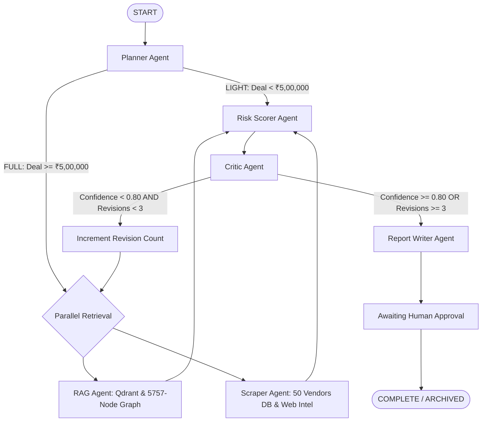

# AutonoSource (pharmProcure) — Multi-Agent Workflow, Nodes & Prompt Engineering

**Document Version:** 3.0.0  
**Target Audience:** Autonomous Agents, AI Engineers, Workflow Developers  
**Framework:** LangGraph Stateful Agent Graph | Google Gemini LLM / Deterministic Python Engine  
**Implementation Source:** `backend/src/agents/` & `backend/src/prompts/`  

---

## 1. Multi-Agent Workflow State Machine

The multi-agent pipeline is built on **LangGraph**. Unlike traditional linear pipelines, it supports **state persistence**, **parallel fan-out routing**, and an **iterative self-correction loop**:



---

## 2. Typed State Schema: `WorkflowState`

The entire state is passed between agents as a typed dictionary (`WorkflowState`) defined in [`backend/src/agents/state.py`](../backend/src/agents/state.py):

```python
class WorkflowState(TypedDict, total=False):
    # --- Case Identification ---
    procurementId: str                     # e.g., "PR-2026-7731-APX"
    vendorName: str                        # Target vendor entity
    dealSize: float                        # Proposed transaction value in INR (₹)
    category: str                          # Formulation / product category
    procurementDetails: str                # Scope specifications & requirements
    investigationPlan: InvestigationPlan   # "LIGHT" | "FULL"
    contractDocumentPath: Optional[str]    # Path to uploaded draft agreement

    # --- Workflow Mechanics & Progress ---
    stage: WorkflowStage                  # PLANNING | EXECUTING | SCORING | CRITIQUING | WRITING_REPORT | AWAITING_APPROVAL | COMPLETE | FAILED
    revisionCount: int                    # Current revision index (0, 1, 2, 3)
    maxRevisions: int                     # Maximum allowed revisions (Default: 3)
    failureReason: Optional[str]          # Populated if workflow halts prematurely
    criticFeedback: Optional[str]         # Feedback string passed from Critic to RAG/Scraper

    # --- Evidence Payloads ---
    evidence_bundle: Dict[str, Any]       # Multi-source evidence dictionary:
                                          # - "structured": vendor financials, credit score, CDSCO/FDA status
                                          # - "pricing_reference": DPCO ceiling price in INR, quoted price, excess
                                          # - "hybrid_rag": Vector & Graph hits, fused facts, confidence
                                          # - "external_intelligence": web scraper warnings, litigation, news

    # --- Synthesized Assessments ---
    riskAssessment: Optional[RiskAssessment]
    report: Optional[ProcurementReport]
    final_report: Optional[Dict[str, Any]]
```

---

## 3. Dedicated Modular Agent Prompts Architecture (`backend/src/prompts/`)

To guarantee strict compliance with Indian pharmaceutical standards and maintain prompt maintainability, all agent system prompts are isolated into dedicated Python modules under [`backend/src/prompts/`](../backend/src/prompts/):

```
backend/src/prompts/
├── __init__.py                # Clean unified exports
├── planner_prompt.py          # LIGHT vs FULL decision criteria & ₹5,00,000 threshold
├── scraper_prompt.py          # Adverse media & regulatory due diligence extraction criteria
├── scorer_prompt.py           # 4-dimensional risk scoring rubric in INR
├── critic_prompt.py           # Self-auditing & contradiction validation instructions
└── writer_prompt.py           # Executive report generation schema in INR
```

---

## 4. Detailed Agent Node Specifications

### 4.1 Planner Agent ([`src/agents/planner.py`](../backend/src/agents/planner.py))
- **Primary Goal:** Deconstructs procurement requests and schedules an appropriate investigation plan (`LIGHT` or `FULL`).
- **Decision Logic ([`src/prompts/planner_prompt.py`](../backend/src/prompts/planner_prompt.py)):**
  - If `dealSize >= ₹5,00,000` OR category involves cold-chain / sterile biologicals ➔ selects `FULL` (fans out to both RAG Agent and Scraper Agent in parallel).
  - If repeat transaction under ₹5,00,000 with established low-risk supplier ➔ selects `LIGHT` (routes straight to Risk Scorer).

### 4.2 RAG Agent ([`src/agents/rag_agent.py`](../backend/src/agents/rag_agent.py))
- **Primary Goal:** Retrieves regulatory provisions and contract clauses in parallel across dense vector embeddings and property graphs:
  - **Vector Retrieval:** Queries local Qdrant collection under `backend/processed_data/qdrant/` (768-dim Nomic embeddings).
  - **Graph Retrieval:** Traverses the 5,757-node NetworkX property graph under `backend/processed_data/graph/knowledge_graph.graphml`.
  - **4-Step Fusion:** Normalizes scores, applies legal priority weights (Acts > Regulations > Contracts > Vendor Claims), and flags explicit contradictions (e.g. ambient transport vs WHO TRS 1025 cold chain).

### 4.3 Scraper Agent ([`src/agents/scraper_agent.py`](../backend/src/agents/scraper_agent.py))
- **Primary Goal:** Gathers enterprise vendor records and external intelligence:
  - **Relational DB Query:** Queries `CaseStore.get_vendor()` from `backend/processed_data/sqlite/procurement_cases.db` to retrieve verified financials, credit scores, and audit ratings for the 50 registered vendors.
  - **DPCO 2013 Price Ceiling Check:** Verifies quotes against statutory ceiling prices in Indian Rupees (INR / ₹).
  - **Live Web Due Diligence:** Executes search across CDSCO warning letters, FDA 483 citations, product recalls, and MCA litigation dockets via [`src/agents/web_scraper.py`](../backend/src/agents/web_scraper.py) using [`src/prompts/scraper_prompt.py`](../backend/src/prompts/scraper_prompt.py).
  - **Dossier Persistence:** Automatically upserts synthesized profiles into the `vendor_profiles` SQLite table.

### 4.4 Risk Scorer Agent ([`src/agents/scorer.py`](../backend/src/agents/scorer.py))
- **Primary Goal:** Evaluates evidence across the 4 core dimensions using [`src/prompts/scorer_prompt.py`](../backend/src/prompts/scorer_prompt.py):
  1. **Financial Risk:** Liquidity, credit ratings, debt-to-equity ratios.
  2. **Compliance Risk:** CDSCO Drugs & Cosmetics Act 1940, Schedule M GMP certification, cold chain transit compliance.
  3. **Contractual Risk:** Liability caps, indemnity obligations, termination notice periods.
  4. **Pricing Risk:** Exact mathematical variance against statutory DPCO 2013 ceiling benchmarks in INR.
- **Confidence Computation:** Aggregates retriever scores and penalizes for unresolved contradictions.

### 4.5 Critic Agent ([`src/agents/critic.py`](../backend/src/agents/critic.py))
- **Primary Goal:** Evaluates evidence completeness and self-corrects using [`src/prompts/critic_prompt.py`](../backend/src/prompts/critic_prompt.py):
  - If `confidenceScore < 0.80` AND `revisionCount < 3`, requests revision with targeted feedback instructions for the RAG and Scraper agents.
  - If `confidenceScore >= 0.80` OR `revisionCount >= 3`, promotes stage to `WRITING_REPORT`.

### 4.6 Report Writer Agent ([`src/agents/writer.py`](../backend/src/agents/writer.py))
- **Primary Goal:** Synthesizes all gathered evidence, flagged contract terms, contradiction resolution trails, and recommendations into an executive `ProcurementReport` in INR using [`src/prompts/writer_prompt.py`](../backend/src/prompts/writer_prompt.py).
