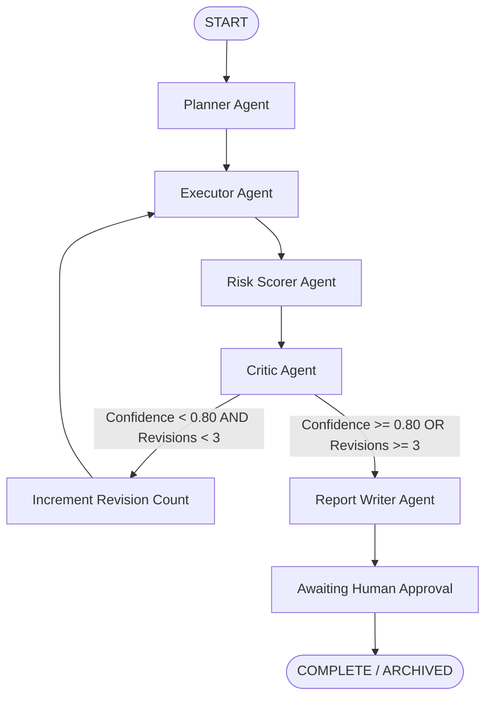

# AutonoSource (pharmProcure) — Multi-Agent Workflow, Nodes & Prompt Engineering

**Document Version:** 2.1.0  
**Target Audience:** Autonomous Agents, AI Engineers, Workflow Developers  
**Framework:** LangGraph Stateful Agent Graph | Google Gemini LLM / Deterministic Python Engine  
**Implementation Source:** `backend/src/agents/` & `backend/src/prompts/`  

---

## 1. Multi-Agent Workflow State Machine

The multi-agent pipeline is built on **LangGraph**. Unlike traditional linear pipelines, it supports **state persistence**, **conditional routing**, and an **iterative self-correction loop**.



---

## 2. Typed State Schema: `WorkflowState`

The entire state is passed between agents as a typed dictionary (`WorkflowState`) defined in [`backend/src/agents/state.py`](../backend/src/agents/state.py):

```python
class WorkflowState(TypedDict, total=False):
    # --- Case Identification ---
    procurementId: str                     # e.g., "PR-2026-7731-APX"
    vendorName: str                        # Target vendor entity
    dealSize: float                        # Proposed transaction value in INR
    category: str                          # Formulation / device category
    procurementDetails: str                # Scope specifications & requirements
    investigationPlan: InvestigationPlan   # "LIGHT" | "FULL"
    contractDocumentPath: Optional[str]    # Path to uploaded draft agreement

    # --- Workflow Mechanics & Progress ---
    stage: WorkflowStage                  # PLANNING | EXECUTING | SCORING | CRITIQUING | WRITING_REPORT | AWAITING_APPROVAL | COMPLETE | FAILED
    revisionCount: int                    # Current revision index (0, 1, 2, 3)
    maxRevisions: int                     # Maximum allowed revisions (Default: 3)
    failureReason: Optional[str]          # Populated if workflow halts prematurely
    criticFeedback: Optional[str]         # Feedback string passed from Critic to Executor

    # --- Evidence Payloads ---
    evidence_bundle: Dict[str, Any]       # Multi-source evidence dictionary:
                                          # - "structured": vendor financials, credit score, FDA 483 citations
                                          # - "pricing_reference": NPPA ceiling price, quoted price, excess
                                          # - "hybrid_rag": Vector & Graph hits, fused facts, confidence
                                          # - "external_intelligence": web scraper warnings, litigation, sentiment

    # --- Synthesized Assessments ---
    riskAssessment: Optional[RiskAssessment]
    report: Optional[ProcurementReport]
    final_report: Optional[Dict[str, Any]]
```

---

## 3. Detailed Agent Node Specifications

### 3.1 Planner Agent (`backend/src/agents/planner.py`)
- **Primary Goal:** Deconstructs procurement requests and schedules an appropriate investigation plan (`LIGHT` or `FULL`).
- **Decision Logic:**
  - If `dealSize > 250,000` OR `category` involves cold-chain / sterile formulations -> selects `FULL` (thorough graph traversal and deep web scraping).
  - If repeat transaction with established vendor under budget -> selects `LIGHT`.
- **Prompt Template ([`backend/src/prompts/planner_prompt.py`](../backend/src/prompts/planner_prompt.py)):**
  ```python
  PLANNER_SYSTEM_PROMPT = """You are the Senior Procurement Planning Specialist for AutonoSource (pharmProcure).
  Your objective is to analyze the proposed deal and determine an optimal investigation scope.
  
  Vendor: {vendor_name}
  Deal Size: USD {deal_size:,.2f}
  Category: {category}
  Details: {details}
  
  Determine:
  1. Mandatory regulatory acts to query (Drugs and Cosmetics Act 1940, Schedule M GMP, WHO TRS 1025).
  2. Investigation depth: LIGHT (low-value repeat orders) or FULL (high-value, cold-chain, or new vendor).
  3. External regulatory sources required (CDSCO circulars, FDA 483 citations, e-Courts dockets).
  """
  ```

---

### 3.2 Executor Agent (`backend/src/agents/executor.py`)
- **Primary Goal:** Gathers multi-source evidence across four distinct dimensions:
  1. **Structured Data:** Financial audit status, Altman Z-score, credit score, historical deals count, FDA 483 citations.
  2. **Regulated Price Reference Data:** Queries `lookup_ceiling_price(category)` against the DPCO 2013 index.
  3. **Hybrid RAG Retrieval:** Parallel execution of `VectorRAGRetriever` (Qdrant) and `GraphRAGRetriever` (NetworkX), fused via `HybridRetriever.retrieve_and_fuse()`.
  4. **External Web Intelligence:** Queries `vendor_scraper.scrape_vendor_intelligence(vendor_name, category)` for adverse media, regulatory warnings, and litigation.

---

### 3.3 Risk Scorer Agent (`backend/src/agents/scorer.py`)
- **Primary Goal:** Computes the 4-Dimensional Risk Assessment and calculates confidence.
- **Evaluation Rules:**
  1. **Financial Risk:**
     - Credit Score < 600 -> `HIGH` ("Severe financial distress").
     - Credit Score 600-699 -> `MEDIUM` ("Moderate credit profile").
     - Active commercial litigation/arbitration flagged by web scraper -> elevates to `MEDIUM` or compounds existing risk.
  2. **Compliance Risk:**
     - FDA 483 citations > 2 -> `HIGH` ("Critical non-compliance").
     - FDA 483 citations > 0 -> `MEDIUM`.
     - Scraped CDSCO show-cause notices or suspension circulars -> `HIGH`.
     - Scraped regulatory advisories or product recall advisories -> `MEDIUM`.
  3. **Contract Risk:**
     - Unresolved contradiction between contract clause and WHO TRS 1025 cold chain -> `MEDIUM` or `HIGH`.
     - Inadequate liability cap (e.g. 1.0x on high-risk shipment) -> `MEDIUM`.
  4. **Pricing Risk:**
     - `WITHIN_CEILING`: Quoted price <= statutory ceiling price.
     - `EXCEEDS_CEILING`: Quoted price > statutory ceiling price (calculates exact excess amount).
     - `INDETERMINATE`: Category has no published statutory ceiling.
  5. **Overall Risk:** Maximum severity across all 4 dimensions.
  6. **Confidence Score Calculation:**
     ```
     confidence = base_fusion_confidence - (0.15 * is_indeterminate) - (0.10 * has_adverse_external_signals)
     ```

---

### 3.4 Critic Agent (`backend/src/agents/critic.py`)
- **Primary Goal:** Audits evidence completeness and resolves low-confidence edge cases.
- **Decision Rules:**
  ```python
  CONFIDENCE_THRESHOLD = 0.80
  
  if score < CONFIDENCE_THRESHOLD and revisionCount < maxRevisions:
      # Trigger revision loop
      state["revisionCount"] += 1
      state["stage"] = WorkflowStage.EXECUTING
      state["criticFeedback"] = f"Confidence {score} below threshold {CONFIDENCE_THRESHOLD}. Gather additional regulatory evidence."
  else:
      # Proceed to report generation
      state["stage"] = WorkflowStage.WRITING_REPORT
  ```
- **Max Revision Cap:** Hard-bounded at 3 revisions. Once reached, proceeds with best available confidence to prevent infinite loops.

---

### 3.5 Report Writer Agent (`backend/src/agents/writer.py`)
- **Primary Goal:** Synthesizes the finalized, auditable `ProcurementReport`.
- **Output Fields:**
  - `vendorSummary`: High-level business overview.
  - `financialAssessment` & `complianceFindings`: Rationale cited from structured and web intelligence.
  - `flaggedContractClauses`: Array of specific contract clauses requiring renegotiation.
  - `evidenceSummary`: Summary of documents, graph nodes, and web URLs scraped.
  - `fusedContext`: Complete ranked facts list with contradiction flags and conflict references.
  - `riskAssessment`: Full 4D risk metrics.
  - `recommendation`: Actionable executive guidance (`APPROVE`, `CONDITIONAL APPROVAL`, or `REJECT / ESCALATE`).
