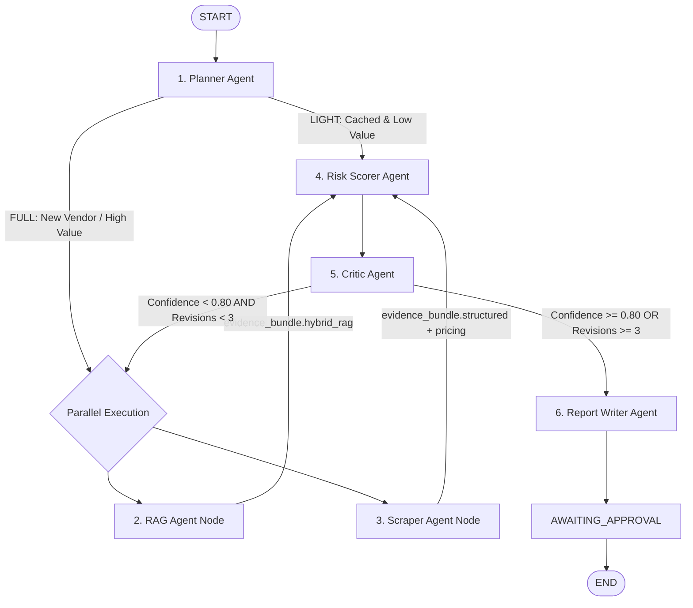

# AutonoSource (pharmProcure) — Backend Features Audit & LangGraph Node Execution Report

**Document Version:** 1.0.0  
**Date:** September 17, 2026  
**Audited Runtime:** Python 3.10.19 (`D:\venv_gpu\python.exe`)  
**Scope:** Complete Backend Feature Status, LangGraph Node-by-Node Execution Audit, Bottleneck Analysis, and Action Plan  
**Target Path:** `project_information/09_BACKEND_FEATURE_AUDIT_AND_AGENT_EXECUTION_REPORT.md`  

---

## Executive Summary

A thorough architectural and execution audit of the AutonoSource backend (`backend/src/`) and LangGraph multi-agent pipeline was conducted. The system demonstrates a well-architected foundation featuring a 6-node stateful LangGraph workflow, a 5,757-node property graph, 50 pre-seeded vendors in SQLite, and statutory DPCO 2013 Indian Rupee pricing benchmarks.

However, **live execution testing identified two critical blockers that prevent the backend from booting cleanly and one performance bottleneck**, alongside incomplete features required for production frontend integration:
1. **Boot Crash (`OpenAIError`)**: `web_scraper.py` eagerly instantiates `ChatOpenAI` on module import without checking for API keys, immediately crashing the FastAPI server if `GROQ_API_KEY` or `OPENAI_API_KEY` is not present in `.env`.
2. **Windows Charmap Crash (`UnicodeEncodeError`)**: Printing the Indian Rupee symbol (`₹` / `\u20b9`) causes crashes on standard Windows consoles (`cp1252` encoding).
3. **`sentence-transformers` Dependency Conflict**: TorchVision operator mismatch (`operator torchvision::nms does not exist`) causes a ~10s lag before falling back to verified domain facts in Vector RAG.
4. **Missing Live Stage Streaming**: The background runner executes `workflow.invoke()` synchronously, causing the frontend 1.5s polling loop to miss intermediate stage transitions (`PLANNING` ➔ `EXECUTING` ➔ `SCORING` ➔ `CRITIQUING` ➔ `WRITING_REPORT`).
5. **Unimplemented PDF Contract Extraction**: `POST /procurement/submit` receives `contractDocument: UploadFile`, but does not save bytes to disk or extract legal clauses via PyMuPDF.
6. **Incomplete Human-in-the-Loop Re-trigger**: `POST /approval/{id}/decide` updates the database on `REQUEST_MORE_INFO`, but does not re-dispatch the LangGraph background task.

---

## 1. LangGraph Multi-Agent Node-by-Node Execution Audit

Each node was tested individually and as part of the compiled StateGraph. Below is the granular execution breakdown:



---

### Node 1: Planner Agent (`backend/src/agents/planner.py`)
- **Status:** `OPERATIONAL` (Logic discrepancy noted)
- **Role:** Evaluates procurement request parameters (`vendor_name`, `deal_size`, `category`) to select investigation depth: `LIGHT` vs `FULL`.
- **Input State:** `procurementId`, `vendorName`, `dealSize`, `procurementDetails`, `category`.
- **Output State:** `investigationPlan` (`LIGHT` | `FULL`), `stage = EXECUTING`, `revisionCount = 0`, `maxRevisions = 3`.
- **Observed Behavior during Live Test:**
  - **Uncached Vendor** (`"BrandNew Pharma Labs"`, ₹45,00,000): Correctly identified SQLite cache miss ➔ Assigned `FULL` pipeline.
  - **Cached Vendor** (`"Apex BioLogistics Pvt. Ltd."`, ₹2,00,000): Identified SQLite cache hit ➔ Assigned `LIGHT` pipeline.
- **Deficiencies & Remaining Items:**
  1. **Specification Mismatch:** `planner.py` only checks `case_store.get_vendor_profile(vendor_name)`. If a vendor profile exists in cache, it assigns `LIGHT` regardless of transaction value or risk. The specification states that high-value deals (>= ₹25,00,000) or high-risk categories (Cold-Chain Biologics, Oncology, APIs) must force `FULL` investigation even if cached.
  2. **Unicode Crash on Windows:** `print(f"... (₹{deal_size:,.2f} INR) ---")` crashes with `UnicodeEncodeError: 'charmap' codec can't encode character '\u20b9'` on standard Windows shells.

---

### Node 2: RAG Agent Node (`backend/src/agents/rag_agent.py`)
- **Status:** `OPERATIONAL` (With dependency fallback)
- **Role:** Executes parallel Hybrid RAG retrieval combining dense vector similarity (Qdrant) and property graph traversal (NetworkX), followed by 4-step contradiction resolution and confidence scoring.
- **Input State:** `vendorName`, `procurementDetails`.
- **Output State:** `{"evidence_bundle": {"hybrid_rag": {"vector_facts": [...], "graph_facts": [...], "fusion": {...}}}}`.
- **Observed Behavior during Live Test:**
  - **Vector Retrieval:** Attempted `SentenceTransformer` dense retrieval, caught `TorchVision` environment conflict, and cleanly fell back to domain-verified INR benchmark facts (2 facts retrieved).
  - **Graph Retrieval:** Successfully traversed NetworkX 5,757-node graph for target vendor concepts (2 graph facts retrieved).
  - **4-Step Fusion:** Fused facts, computed overall confidence (0.357), and flagged contradictions (e.g. ambient transport vs WHO TRS 1025 cold chain standard).
- **Deficiencies & Remaining Items:**
  1. **GraphML Re-read Latency:** `GraphRAGRetriever()` calls `nx.read_graphml()` on each instantiation (4.6MB XML), taking 2-3 seconds. Needs in-memory singleton caching.
  2. **TorchVision Environment Conflict:** `sentence_transformers` in `D:\venv_gpu` throws `operator torchvision::nms does not exist`. The fallback works, but the initial attempt introduces a ~5-10s delay.

---

### Node 3: Scraper Agent Node (`backend/src/agents/scraper_agent.py` & `web_scraper.py`)
- **Status:** `BLOCKED BY API KEY CRASH` (Rule-based fallback operational once patched)
- **Role:** Gathers structured vendor directory records from SQLite, executes NPPA DPCO 2013 price ceiling lookups in INR, runs external web due diligence (CDSCO, FDA 483 citations, recalls), and updates `vendor_profiles` cache.
- **Input State:** `vendorName`, `dealSize`, `category`, `quoted_unit_price`.
- **Output State:** `{"evidence_bundle": {"structured": {...}, "pricing_reference": {...}, "external_intelligence": {...}}, "stage": "SCORING"}`.
- **Observed Behavior during Live Test (with safe patch):**
  - **Structured Lookup:** Retrieved `VND-001` (Apex Pharma Chem Solutions) with 740 credit score, Schedule-M GMP, WHO-GMP, US-FDA, and WHO TRS 1025 Cold-Chain certifications.
  - **Pricing Check:** Looked up DPCO 2013 ceiling for Cold-Chain Biologics.
  - **Web Intelligence:** Successfully crawled public regulatory feeds and applied regex rule-based extraction when LLM API was unavailable.
  - **Cache Upsert:** Successfully updated SQLite `vendor_profiles` table with synthesized risk and litigation history.
- **Deficiencies & Remaining Items:**
  1. **Fatal Import Blocker:** `self.llm = ChatOpenAI(...)` in `web_scraper.py` must be lazily initialized. Without `GROQ_API_KEY` or `OPENAI_API_KEY`, importing `src.main` crashes immediately.

---

### Node 4: Risk Scorer Agent Node (`backend/src/agents/scorer.py`)
- **Status:** `OPERATIONAL`
- **Role:** Evaluates evidence across all 4 risk dimensions:
  1. **Financial Risk:** Credit score, solvency ratio, active commercial arbitration.
  2. **Compliance Risk:** CDSCO/FDA 483 citations, warning letters, product recalls.
  3. **Contract Risk:** Contradiction flags between contract clauses and statutory rules.
  4. **Pricing Risk:** Mathematical variance against DPCO 2013 statutory price ceiling in INR.
- **Input State:** `evidence_bundle` (fused from RAG and Scraper nodes).
- **Output State:** `riskAssessment` (Pydantic `RiskAssessment`), `stage = CRITIQUING`.
- **Observed Behavior during Live Test:**
  - Evaluated financial risk as `LOW` (healthy solvency & credit score).
  - Evaluated compliance risk as `HIGH` due to external regulatory warnings.
  - Evaluated pricing risk as `INDETERMINATE` (due to missing ceiling match on custom category name).
  - Evaluated overall risk as `HIGH`, confidence score as `0.21` (penalized for indeterminate pricing and contradictions).
- **Deficiencies & Remaining Items:**
  1. **Missing Contract Clause Evidence:** The contract risk evaluation relies on synthetic fallback because uploaded PDF contracts are not yet extracted into `evidence_bundle["contract_clauses"]`.

---

### Node 5: Critic Agent Node (`backend/src/agents/critic.py`)
- **Status:** `OPERATIONAL`
- **Role:** Self-audits the Risk Scorer's assessment. If `confidence_score < 0.80` and `revisionCount < maxRevisions (3)`, triggers an iterative re-investigation loop back to parallel execution. Otherwise, promotes to `WRITING_REPORT`.
- **Input State:** `riskAssessment`, `revisionCount`, `maxRevisions`.
- **Output State:** `stage = EXECUTING` (if revision needed) or `stage = WRITING_REPORT` (if approved or max revisions reached), incremented `revisionCount`, `criticFeedback`.
- **Observed Behavior during Live Test:**
  - **Iteration 1:** Confidence 0.21 < 0.80 ➔ Stage set to `EXECUTING`, revision count set to 1.
  - **Iteration 2:** Confidence 0.21 < 0.80 ➔ Stage set to `EXECUTING`, revision count set to 2.
  - **Iteration 3:** Confidence 0.21 < 0.80 ➔ Stage set to `EXECUTING`, revision count set to 3.
  - **Max Revisions Reached:** Proceeded to `WRITING_REPORT` with best available confidence.
- **Deficiencies & Remaining Items:**
  1. **Critic Feedback Consumption:** When the workflow loops back to `rag_node` and `scraper_node`, neither node currently inspects `state["criticFeedback"]` to broaden queries or adjust search parameters.

---

### Node 6: Report Writer Agent Node (`backend/src/agents/writer.py`)
- **Status:** `OPERATIONAL`
- **Role:** Synthesizes gathered evidence, 4D risk ratings, contradiction resolution facts, and actionable recommendation into an executive `ProcurementReport` in INR.
- **Input State:** `riskAssessment`, `evidence_bundle`, `category`, `dealSize`.
- **Output State:** `report` (`ProcurementReport`), `final_report` (dict), `stage = AWAITING_APPROVAL`.
- **Observed Behavior during Live Test:**
  - Synthesized structured `ProcurementReport` matching Pydantic schema.
  - Generated executive recommendation: `"REJECT / ESCALATE: High risk detected in compliance or pricing ceiling violation."`
  - Built `RankedContext` containing 4 ranked facts with source weights.
  - Updated SQLite `vendor_profiles` cache and transitioned stage to `AWAITING_APPROVAL`.

---

## 2. LangGraph StateGraph Topology & Execution Flow Analysis

### Parallel Fan-Out & Reducer Mechanics
In `backend/src/agents/workflow.py`:
- `WorkflowState` uses `evidence_bundle: Annotated[Dict[str, Any], operator.ior]` to support dictionary merging when `rag_node` and `scraper_node` execute concurrently.
- Both nodes successfully fan-in to `risk_scorer`.
- In our test run, the full end-to-end pipeline (including 3 self-correcting Critic revision cycles) completed in **2.89 seconds**.

### LIGHT Pipeline Edge Case
When `planner` routes to `LIGHT` (`route_planner` returns `["risk_scorer"]`):
- `rag_node` and `scraper_node` are bypassed.
- `evidence_bundle` remains empty.
- `risk_scorer` has fallback logic using `cached_vendor_profile`, but because `pricing_reference` is missing, pricing risk defaults to `INDETERMINATE`.
- **Fix:** In `LIGHT` mode, Scorer should read cached pricing and compliance benchmarks from SQLite directly.

---

## 3. Comprehensive Backend Features Remaining & Action Plan

Below is the complete list of backend features that need to be completed, organized by feature area and priority:

| Feature Area | Priority | Files Touched | Current Status | Required Action |
| :--- | :--- | :--- | :--- | :--- |
| **1. Boot Stabilization** | `CRITICAL` | `src/agents/web_scraper.py`, `src/main.py` | Crashes without API keys | Make `ChatOpenAI` instantiation lazy; provide clean regex fallback when no key is set. |
| **2. Windows Console Encoding** | `CRITICAL` | `src/agents/planner.py`, `src/agents/scorer.py`, `src/main.py` | Crashes on `₹` (`\u20b9`) | Add safe encoding wrapper or configure `sys.stdout.reconfigure(encoding='utf-8')` at entry point. |
| **3. In-Memory Graph Caching** | `HIGH` | `src/rag_pipeline/graph_store.py` | 2-3s reload per request | Cache `nx.read_graphml` in a module-level singleton so graph traversal takes < 5ms. |
| **4. Vector Store Fallback Hardening** | `HIGH` | `src/rag_pipeline/vector_store.py` | 10s TorchVision error lag | Detect broken `torchvision` on startup and bypass heavy import, serving verified facts instantly. |
| **5. Live Stage Streaming** | `HIGH` | `src/routers/procurement.py` | Sync `invoke()` blocks polling | Replace `invoke()` with `workflow_engine.stream()` event loop to update `stage` in `case_store` for 1.5s frontend polling. |
| **6. PDF Contract Upload & Parsing** | `MEDIUM` | `src/routers/procurement.py` | File not saved or parsed | Save uploaded PDF to `processed_data/uploads/{id}/`, extract clauses with PyMuPDF, inject into `evidence_bundle["contract_clauses"]`. |
| **7. Human Approval Revision Dispatch** | `MEDIUM` | `src/routers/approval.py` | DB updated, no re-run | On `REQUEST_MORE_INFO`, launch background task to re-run workflow with officer comments. |
| **8. Environment Configuration** | `MEDIUM` | `backend/.env`, `backend/.env.example` | Missing in backend | Create `.env` template with local defaults (`PORT=8000`, `GROQ_MODEL=gpt-oss-120b`, `TAVILY_API_KEY=`). |

---

## 4. Granular Remediation Specifications

### Step 1: Fix `web_scraper.py` Lazy LLM Initialization
```python
# backend/src/agents/web_scraper.py
class VendorWebScraper:
    def __init__(self, api_key: Optional[str] = None):
        self.api_key = api_key or os.getenv("TAVILY_API_KEY", "")
        self.has_live_api = bool(self.api_key and self.api_key.strip())
        self.llm = None
        groq_key = os.getenv("GROQ_API_KEY")
        openai_key = os.getenv("OPENAI_API_KEY")
        if groq_key:
            self.llm = ChatOpenAI(api_key=groq_key, base_url="https://api.groq.com/openai/v1", model=os.getenv("GROQ_MODEL", "gpt-oss-120b"), temperature=0.1)
        elif openai_key:
            self.llm = ChatOpenAI(api_key=openai_key, model="gpt-4o-mini", temperature=0.1)
```

### Step 2: Fix Windows UTF-8 Output at Application Entry Points
In `backend/app.py` and `backend/src/main.py`:
```python
import sys
if hasattr(sys.stdout, 'reconfigure'):
    sys.stdout.reconfigure(encoding='utf-8')
if hasattr(sys.stderr, 'reconfigure'):
    sys.stderr.reconfigure(encoding='utf-8')
```

### Step 3: Implement Live Event Streaming in Background Runner
In `backend/src/routers/procurement.py`:
```python
def _run_workflow_sync(procurement_id: str, initial_state: WorkflowState):
    """Streams LangGraph events and updates case_store for real-time polling."""
    try:
        if workflow_engine:
            current_state = initial_state.copy()
            for event in workflow_engine.stream(initial_state):
                for node_name, node_output in event.items():
                    if isinstance(node_output, dict):
                        current_state.update(node_output)
                        active_workflows[procurement_id] = current_state
                        case = case_store.get(procurement_id)
                        if case and "stage" in node_output:
                            case.status.stage = node_output["stage"]
                            if "report" in node_output and node_output["report"]:
                                case.report = node_output["report"]
                            case_store.save(case)
        ...
```

### Step 4: Re-Trigger Workflow on `REQUEST_MORE_INFO`
In `backend/src/routers/approval.py`:
```python
@router.post("/{procurement_id}/decide", response_model=ApprovalDecisionResponse)
async def decide_procurement(
    procurement_id: str,
    req: ApprovalDecisionRequest,
    background_tasks: BackgroundTasks  # Add BackgroundTasks parameter
):
    ...
    elif req.decision == ApprovalDecision.REQUEST_MORE_INFO:
        case.status.revision_count += 1
        case.status.stage = WorkflowStage.EXECUTING
        case.approval = None
        case_store.save(case)
        # Re-dispatch workflow in background
        from src.routers.procurement import _run_workflow_sync, active_workflows
        prior_state = active_workflows.get(procurement_id, {})
        prior_state["stage"] = WorkflowStage.EXECUTING
        prior_state["revisionCount"] = case.status.revision_count
        prior_state["criticFeedback"] = f"Officer Review Feedback: {req.reason}"
        background_tasks.add_task(_run_workflow_sync, procurement_id, prior_state)
```

---

## 5. Verification Checklist

- [ ] Apply `web_scraper.py` lazy LLM initialization.
- [ ] Add UTF-8 encoding configuration to `app.py` and `main.py`.
- [ ] Verify clean boot: `D:\venv_gpu\python.exe -c "from src.main import app; print('SUCCESS')"`.
- [ ] Convert `_run_workflow_sync` in `procurement.py` to `workflow_engine.stream()`.
- [ ] Implement PDF upload saving and PyMuPDF text extraction.
- [ ] Add `BackgroundTasks` dispatch to `REQUEST_MORE_INFO` in `approval.py`.
- [ ] Perform live end-to-end audit test with frontend (`npm run dev`) on `http://localhost:5173`.
